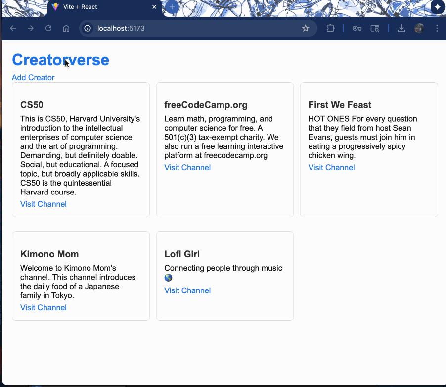

# WEB103 Prework - *Creatorverse*

Submitted by: **Jadine Delfin-Watanabe**

About this web app: **I built Creatorverse to share some of my favorite content creators and practice using React with Supabase. The app lets me add, edit, view, and delete creators, and it shows a little bit about the different interests I follow.**

Time spent: **9** hours

## Required Features

The following **required** functionality is completed:

- [x] **A logical component structure in React is used to create the frontend of the app**
- [x] **At least five content creators are displayed on the homepage of the app**
- [x] **Each content creator item includes their name, a link to their channel/page, and a short description of their content**
- [x] **API calls use the async/await design pattern via Axios or fetch()**
- [x] **Clicking on a content creator item takes the user to their details page, which includes their name, url, and description**
- [x] **Each content creator has their own unique URL**
- [x] **The user can edit a content creator to change their name, url, or description**
- [x] **The user can delete a content creator**
- [x] **The user can add a new content creator by entering a name, url, or description and then it is displayed on the homepage**

The following **optional** features are implemented:

- [ ] Picocss is used to style HTML elements
- [x] The content creator items are displayed in a creative format, like cards instead of a list
- [ ] An image of each content creator is shown on their content creator card

The following **additional** features are implemented:

- [x]  Added a media folder for storing walkthrough gif

## Video Walkthrough

Here's a walkthrough of implemented required features:

GIF created with LICEcap

## Notes

I used GitHub Copilot AI to help me debug and troubleshoot some error messages I didn’t understand. Working on this project also gave me a chance to review aspects of React and JavaScript. I also got to practice connecting everything with Supabase and managing my code with GitHub.

## License

Copyright 2025 Jadine Delfin-Watanabe

Licensed under the Apache License, Version 2.0 (the "License"); you may not use this file except in compliance with the License. You may obtain a copy of the License at

> http://www.apache.org/licenses/LICENSE-2.0

Unless required by applicable law or agreed to in writing, software distributed under the License is distributed on an "AS IS" BASIS, WITHOUT WARRANTIES OR CONDITIONS OF ANY KIND, either express or implied. See the License for the specific language governing permissions and limitations under the License.
